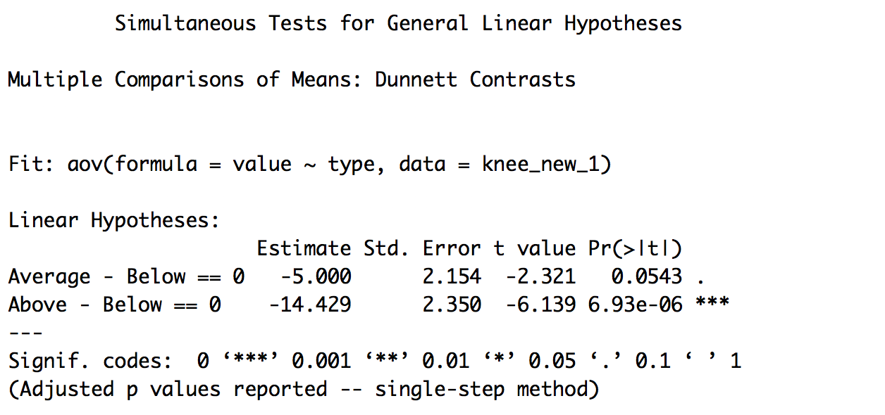

### I have a webpage!

And I can put all kinds of stuff on it!

I can add additional text.

I *could* write some code but I'm not going to. 


###Add some links

I like [google](https://www.google.com)

I like [to look for code on the internet](https://www.google.com).

I can link directly to my [about page](about.html).


###Picture




###I can add code

```{r}
library(tidyverse)

tibble(
  x = 1:10,
  y = x+2
)
```


